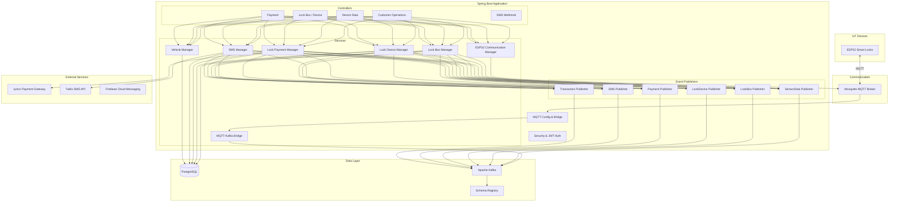

# IoT Device Management Platform


IoT smart lock management platform built with Spring Boot. Manages ESP32-based smart lock devices via MQTT, handles payment processing through Iyzico, sends SMS notifications via Twilio, and streams all events through Apache Kafka with Avro serialization.

## Architecture



## Technology Stack

| Technology | Purpose |
|---|---|
| Java 17 | Runtime |
| Spring Boot 3.3 | Application framework |
| Spring Security + JWT | Authentication and authorization |
| Spring Integration MQTT | MQTT broker communication |
| Apache Kafka + Avro | Event streaming with schema evolution |
| Confluent Schema Registry | Avro schema management |
| PostgreSQL | Relational data persistence |
| Iyzico | Payment processing (Turkey) |
| Twilio | SMS notifications and OTP |
| Firebase Admin SDK | Push notifications |
| Eclipse Paho | MQTT client for ESP32 devices |
| SpringDoc OpenAPI | API documentation (Swagger UI) |
| Micrometer / Prometheus | Application metrics |
| ModelMapper | Object mapping |
| Lombok | Boilerplate reduction |

## Key Features

- **MQTT Device Communication** - Bidirectional communication with ESP32 smart lock devices via Mosquitto MQTT broker
- **MQTT-to-Kafka Bridge** - Automatically bridges MQTT sensor data to Kafka topics for downstream processing
- **Smart Lock Management** - Full CRUD for lock boxes and lock devices with status tracking (AVAILABLE, IN_USE, LOCKED, UNLOCKED, MAINTENANCE)
- **Payment Processing** - Iyzico payment gateway integration with callback handling, deposit and penalty calculations
- **SMS Notifications** - Twilio-based SMS service with OTP generation, delivery tracking, and webhook support
- **Event-Driven Architecture** - All domain operations publish events to Kafka using Avro serialization
- **Device Authentication** - Custom `DeviceAuthFilter` for ESP32 device credential validation
- **JWT Security** - Token-based authentication for API access
- **Push Notifications** - Firebase Cloud Messaging for real-time mobile notifications
- **API Documentation** - Auto-generated Swagger UI at `/swagger-ui.html`

## Project Structure

```
src/main/java/com/selftech/smartlock/
├── SmartLockApplication.java
├── config/
│   ├── AsyncConfig.java                    # Async task executor configuration
│   ├── DeviceAuthFilter.java               # ESP32 device authentication
│   ├── MQTTConfig.java                     # MQTT broker connection setup
│   ├── RestTemplateConfig.java             # HTTP client configuration
│   ├── SecurityConfig.java                 # Spring Security & JWT setup
│   ├── TwilioConfig.java                   # Twilio SDK initialization
│   ├── TwilioStartupValidator.java         # Validates Twilio credentials on startup
│   └── WebConfig.java                      # CORS and web settings
├── controller/
│   ├── CustomerOperationController.java    # Customer-facing lock operations
│   ├── DeepLinkController.java             # Mobile deep link handling
│   ├── DeviceDataController.java           # Device telemetry endpoints
│   ├── LockBoxController.java              # Lock box CRUD
│   ├── LockDeviceController.java           # Lock device CRUD
│   ├── PaymentCallbackController.java      # Iyzico payment callbacks
│   ├── PaymentController.java              # Payment initiation
│   ├── PaymentPageController.java          # Payment page rendering
│   ├── PersonnelOperationController.java   # Admin/personnel operations
│   └── TwilioSmsWebHookController.java     # SMS delivery webhooks
├── event/kafka/publisher/
│   ├── ILockBoxEventPublisher.java
│   ├── ILockDeviceEventPublisher.java
│   ├── IPaymentEventPublisher.java
│   ├── LockBoxEventPublisherService.java
│   ├── LockDeviceEventPublisherService.java
│   ├── LockOperationEventPublisherService.java
│   ├── PaymentEventPublisherService.java
│   ├── SensorDataEventPublisherService.java
│   ├── SmsEventPublisherService.java
│   └── TransactionEventPublisherService.java
├── models/
│   ├── dto/
│   │   ├── enums/                          # BoxStatus, DeviceStatus, PaymentStatus, etc.
│   │   ├── request/                        # LockBoxAddRequest, PaymentRequest, SmsRequest, etc.
│   │   └── response/                       # ApiResponse, PaymentResponse, etc.
│   └── entity/
│       ├── BoxOperation.java
│       ├── DeviceCredential.java
│       ├── DeviceOperation.java
│       ├── LockBox.java
│       ├── LockDevice.java
│       ├── SmsLog.java
│       └── Vehicle.java
├── repository/
│   ├── DeviceCredentialRepository.java
│   ├── LockBoxOperationRepository.java
│   ├── LockBoxRepository.java
│   ├── LockDeviceOperationRepository.java
│   ├── LockDeviceRepository.java
│   ├── OTPRepository.java
│   ├── SmsLogRepository.java
│   └── VehicleRepository.java
├── service/
│   ├── abstracts/                          # Service interfaces
│   └── concretes/
│       ├── Esp32CommunicationManager.java  # MQTT commands to ESP32
│       ├── LockBoxManager.java             # Lock box business logic
│       ├── LockBoxOperationManager.java    # Box operation tracking
│       ├── LockDeviceManager.java          # Lock device business logic
│       ├── LockDeviceOperationManager.java # Device operation tracking
│       ├── LockPaymentManager.java         # Payment orchestration
│       ├── MqttToKafkaBridgeService.java   # MQTT -> Kafka bridge
│       ├── SmsManager.java                 # SMS sending and tracking
│       └── VehicleManager.java             # Vehicle management
└── utils/
    ├── OTPGenerator.java                   # One-time password generation
    ├── ValidationUtil.java                 # Input validation utilities
    └── exceptions/
        ├── GlobalExceptionHandler.java     # Centralized error handling
        ├── SmartLockException.java
        └── SmsSendingException.java
```

## Avro Schemas

| Schema | Description |
|---|---|
| `SensorDataEvent.avsc` | IoT sensor readings (battery, temperature, humidity, weight, GPS, door/lock status) |
| `LockOperationEvent.avsc` | Lock/unlock operation events with status tracking |
| `SmsEvent.avsc` | SMS event lifecycle (SENT, DELIVERED, FAILED, PENDING) |
| `smartlock/LockBoxEvent.avsc` | Lock box lifecycle events (creation, status changes, door operations) |
| `smartlock/LockDeviceEvent.avsc` | Lock device lifecycle events (status transitions, battery, signal) |
| `smartlock/PaymentEvent.avsc` | Payment lifecycle (initiation, completion, failure, refund) |
| `smartlock/TransactionEvent.avsc` | Customer transaction events (retrieval, return, code validation) |

## Prerequisites

- Java 17+
- PostgreSQL 14+
- Apache Kafka 3.6+ with Confluent Schema Registry
- Mosquitto MQTT Broker
- Maven 3.8+
- Iyzico merchant account (for payment processing)
- Twilio account (for SMS notifications)

## Dependencies

This service depends on the shared [spring-kafka-infrastructure](https://github.com/erhanbarisolmez/spring-kafka-infrastructure) library, which provides Kafka topic registry, event coordination, DLQ management, and outbox pattern support.

```
spring-kafka-infrastructure (Maven library)
         │
         ▼
iot-device-management-platform (this service)
```

## Getting Started

1. **Clone the repository**
   ```bash
   git clone https://github.com/erhanbarisolmez/iot-device-management-platform.git
   cd iot-device-management-platform
   ```

2. **Install the shared library** (if not published to GitHub Packages yet)
   ```bash
   cd ../spring-kafka-infrastructure
   mvn clean install
   cd ../iot-device-management-platform
   ```

3. **Configure environment variables**
   ```bash
   # Database
   export SPRING_DATASOURCE_URL=jdbc:postgresql://localhost:5432/smartlock
   export SPRING_DATASOURCE_USERNAME=postgres
   export SPRING_DATASOURCE_PASSWORD=postgres

   # Kafka
   export KAFKA_BOOTSTRAP_SERVERS=localhost:9092
   export KAFKA_SCHEMA_REGISTRY_URL=http://localhost:8081

   # MQTT
   export MQTT_BROKER_URL=tcp://localhost:1883

   # JWT
   export JWT_SECRET_KEY=your-256-bit-secret-key

   # Twilio
   export TWILIO_ACCOUNT_SID=your-account-sid
   export TWILIO_AUTH_TOKEN=your-auth-token
   export TWILIO_PHONE_NUMBER=+1234567890

   # Iyzico
   export IYZICO_API_KEY=your-api-key
   export IYZICO_SECRET_KEY=your-secret-key
   ```

4. **Build the project**
   ```bash
   mvn clean install
   ```

5. **Run the application**
   ```bash
   mvn spring-boot:run
   ```

6. **Access API documentation**
   ```
   http://localhost:8080/swagger-ui.html
   ```

## Docker

```bash
# Build
mvn clean package -DskipTests
docker build -t erhanbarisolmez/iot-device-management-platform:latest .

# Run
docker run -p 8080:8080 \
  -e SPRING_DATASOURCE_URL=jdbc:postgresql://postgres:5432/smartlock \
  -e SPRING_DATASOURCE_USERNAME=postgres \
  -e SPRING_DATASOURCE_PASSWORD=postgres \
  -e KAFKA_BOOTSTRAP_SERVERS=kafka:9092 \
  -e KAFKA_SCHEMA_REGISTRY_URL=http://schema-registry:8081 \
  -e MQTT_BROKER_URL=tcp://mosquitto:1883 \
  -e JWT_SECRET_KEY=your-secret-key \
  erhanbarisolmez/iot-device-management-platform:latest
```

## Kubernetes / Helm

```bash
# Install with Helm
helm install smartlock ./helm \
  --set image.tag=latest \
  --namespace selftech --create-namespace

# Upgrade
helm upgrade smartlock ./helm --set image.tag=v1.0.0

# Uninstall
helm uninstall smartlock
```
